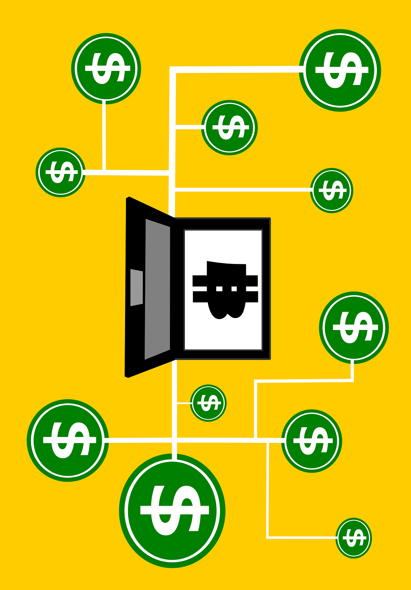

at (current page.center) [{width="\paperwidth"
height="\paperheight"}]{};

[ ]{} [University of Victoria\
]{} [Faculty of Engineering\
]{} [ENGR 446: Milestone Report I: Project Background\
]{}

------------------------------------------------------------------------

\

[David Li Computer Engineering V00818631 ]{}

[\
]{} [In partial fulfillment of the academic requirements of this
academic course]{}

Background
==========

In 2008 bitcoin white paper [@bitcoinWhitePaper:Online] described a way
to solve the double spending problem without a centralized body using
[blockchain]{}. Although, the value of bitcoin (BTC) has grown
exponentially, high computational and energy consumption in mining and
slow performance [@bitCoinProblems:Online]. Released in July 30, 2015,
Ethereum, an open-source platform based on blockchain technology,
distinguishes itself from bitcoin through faster transactions, unlimited
processing capability for [smart contract]{}, and its network is
optimized to support Decentralized Applications
[@ethereumWhitePaper:Online].

[@r &lt; ![[-0.5ptwidth 1pt]{}]{} &gt;p[5cm]{}]{} 2008 & Bitcoin White
Paper\
2009 & Bitcoin Genesis Block\
2013 & 1 BTC = \$ 31 USD\
2013 & Ethereum White Paper\
2015 & Ethereum Genesis Block\
2015 & HyperLedger starts\
2017 & Over 1000 different cryptocurrencies\
2018 & AWS Blockchain Templates\

Blockchain technology is revolutionizing the internet by establishing
trust in shared data. [@ethereumWhitePaper:Online]. Additionally,
transactions recorded on the blockchain are practically impossible to
remove or change. A decentralized application, or DApp are deployed on
peer to peer networks such as Ethereum or on the cloud. A decentralized
system (peer to peer) has many advantages over a conventional
centralized network including no single points of failure, cheaper
distribution (servers are expensive), faster upload speeds and improved
security.

Traditional legal contracts are written to represent the contracting
parties. In a smart contract, self-executing source code is used to
automatic transactions that are publicly available on the blockchain
[@ethereumWhitePaper:Online]. Furthermore, smart contracts allow buyers
and sellers exchange money, property, shares, or anything of value in a
transparent, conflict-free way while avoiding the services of a
middleman. This allows validation of complex transactions swiftly while
maintaining transparency.

![Illustrating how a smart contract
works[]{data-label="fig:smartContracts"}](smartContractsExp.pdf){width="1\linewidth"}

Objective
=========

Problem
-------

Purpose
-------

Aims
----

The aims of this project are to develop a decentralized blockchain
system that:

1.  Reduce cost of transactions by at least 50% from removing middlemen.

2.  Improve transparency in software systems through augmented
    accessibility and understandability.

3.  Has increased reliability and more secure than traditional systems.

Limitations
-----------

The regulatory uncertainty and impact of future regulations on
blockchain technologies such as smart contracts will not be
investigated.

Potential Solutions
===================

-   **Public blockchains** are large distributed networks that are run
    through a native token such as bitcoin or ether. Anyone can
    participate and the community maintains its open-source code. The
    two largest public blockchains are Ethereum and Bitcoin.

-   **Permissioned blockchains** define role based access control for
    individuals in the network and uses native tokens. HyperLedger
    Composer, an open-source framework for permissioned blockchains, is
    used for smart contracts and for blockchain application development
    [@hyperledgerComposer:Online]. One use case is an accounting system
    that calculates payment, while hiding that information from
    unrelated organizations.

-   **Private blockchains** membership is tightly controlled and lacks a
    native token. Useful for consortiums with trusted associates and
    exchanging confidential information, however, less powerful because
    it is supported by limited private resources.

Initial Assessment
==================

[D E A B C ]{} & &\
& & & &\
speed and latency & & & &\
scale and volume & & & &\
security and immutablity & & & &\
storage capacity & & & &\
transparency & & & &\
& & & &
